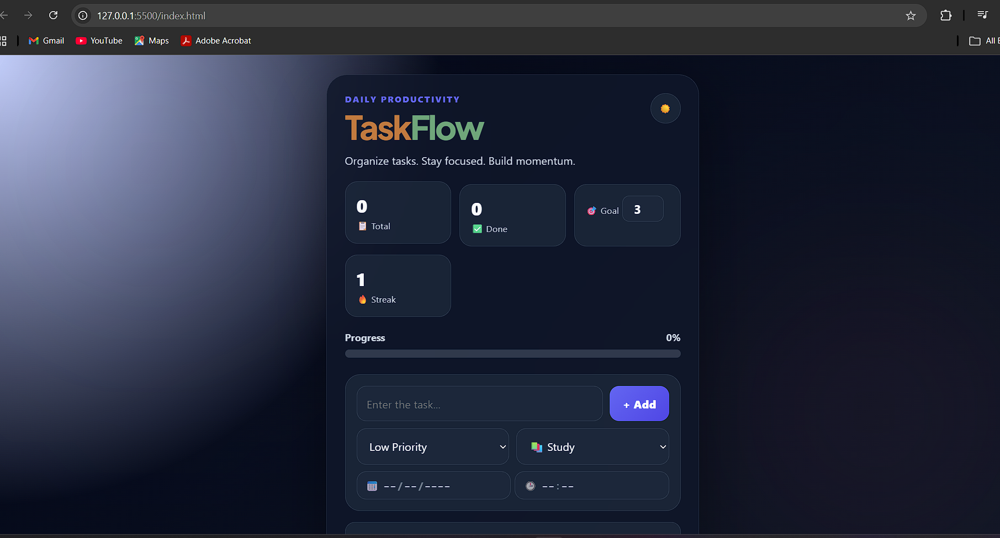

# 🚀 TaskFlow

TaskFlow is a modern productivity and task management web application built using HTML, CSS, JavaScript, Flask, and SQLite. It helps users organize tasks, track daily goals, monitor productivity, and stay consistent with a clean, responsive interface.

---

## ✨ Features

- ✅ Add, Edit, and Delete Tasks
- 🌙 Dark Mode
- 📊 Progress Bar
- 🔥 Daily Streak Tracking
- 🎯 Daily Goal Tracking
- 🏷️ Task Priority Levels
- 📅 Due Date & Time
- 🔍 Search Tasks
- 📂 Task Categories
- 📱 Responsive Design
- 🧭 Bottom Navigation (Home, Notifications, Profile)
- 💾 Local Storage Support
- ⚙️ Flask + SQLite Backend 

  

---

## 🛠️ Tech Stack

### Frontend
- HTML5
- CSS3
- JavaScript

### Backend
- Python
- Flask
- SQLite

---

## 📸 Screenshot

> Replace this with your GitHub image link after uploading the screenshot.

# Home

# Darkmode

---

## 🚧 Upcoming Features

- 👤 User Login & Sign Up
- 🔐 User Authentication
- 🔔 Smart Notifications
- 📅 Calendar View
- 🤖 AI Task Assistant
- 🎤 Voice Commands
- ☁️ Cloud Database
- 📈 Analytics Dashboard

---

## 📅 Development Journey

### Day 43
- Added responsive mobile layout
- Added bottom navigation
- Created Home, Notifications, and Profile pages
- Improved mobile responsiveness
- Prepared the frontend for backend integration

---
## 📅 Day 44

### 🚀 Progress
- Connected frontend with Flask backend
- Implemented REST API integration
- Added task creation using SQLite
- Added task editing using SQLite
- Added task deletion using SQLite
- Fixed database path issues
- Configured CORS for frontend-backend communication

### 🔜 Next Steps
- Save task completion status in SQLite
- Connect Clear All to backend
- Remove remaining task-related localStorage

## 📅 Day 45

### 🚀 Progress
- Connected the frontend with the Flask backend
- Integrated SQLite database with the frontend
- Implemented full CRUD operations using REST API
- Added task creation using POST requests
- Added task loading using GET requests
- Added task editing using PUT requests
- Added task deletion using DELETE requests
- Added task completion persistence in SQLite
- Configured CORS for frontend-backend communication
- Removed task dependency on Local Storage (migration to SQLite)

### 🛠️ Tech Used
- HTML5
- CSS3
- JavaScript (Fetch API)
- Python
- Flask
- SQLite

### 🎯 Next Steps
- User Authentication (Login & Sign Up)
- User Profiles
- Notifications
- Calendar Integration
- AI Task Assistant
- Voice Commands
  
## 🎯 Project Status

🚧 Currently under active development.

The next milestone is connecting the frontend with the Flask backend so all task operations use the SQLite database instead of Local Storage.

---

## 👨‍💻 Author

**Subhash**

GitHub: https://github.com/Subhash0817
